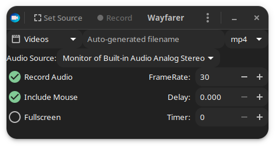
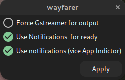

# Wayfarer - Screen Recorder for GNOME / Wayland / Pipewire

## Features and limitations

**wayfarer** is a screen recorder for GNOME

* Modern GNOME desktop (Arch, Fedora, Debian Testing, Ubuntu 22.04)
* Wayland or Xorg
* Pipewire / Pulseaudio / libportal (XDG Desktop Portal)
* Wireplumber recommended

In X11 mode, it may support other desktops (untested); in Wayland mode, other desktops are not supported (but may "work").

Requires:

* Gtk 4
* Vala
* Gstreamer 1.0
* libpulse-mainloop-glib (libpulse-dev on Debian et al.)
* (optional, otherwise installed locally by the build system), Blueprint (Gtk Builder compiler).

* XDG Portal (at run time)

There is also an obsolete  Gtk3 branch

* Gtk 3
* Vala
* Gstreamer 1.0
* AppIndicator
* XDG Portal

**wayfarer** supports MKV, MP4 and WebM video container (vp8, vp9, mp4) with Opus or MP3 as the audio format. The available video codecs presented in the UI are those discovered on your system. Where VAAPI versions are available, they will also be offered.

wayfarer uses the XDG Portal on modern desktops, with all the pain and diminished functionality that the portal implies.

* Portal connection is set to persist, pressing Control-R clears the persistent state, re-enabling the portal monitor selection screen.
* Selection across multiple monitors and full screen across multiple monitors is available
* Window selection is not supported, as the portal support is not helpful.

## User Interface



* Define an area using the `Set Source` control. Drag the displayed control to size.
    - Right Mouse Button, Middle Mouse Button, "Space" or "Enter" to confirm.
    - "Esc" to abort.
* Confirm the audio source
* `Delay` defines a delay (seconds) before recording starts
* `Timer` defines the length of the recording (seconds) : 0 (default) means user will stop the recording.
* `Record` starts the recording; requires an area defined or `Fullscreen`

If `Control_L` is pressed when `Set Source` is clicked, then the main window will be hidden during the area selection process.

If `Control_L` is pressed when `Record` is clicked, then the stop recording window will be hidden during the recording process.

Once recording is started:

* If `Timer` is set, the recording will run for the set number of seconds
* Gtk3: If an AppIndicator tray is used, there will be an icon in the system tray, clicking this provides a "Stop Recording" button.
* Gtk4: A small window provides a "Stop Recording" button.
* Gtk4/GnomeShell: The recording can be stopped from the panel Portal indicator.
* Otherwise, use the "Preferences" menu and set `Use notifications (vice App Indicator)`. Clicking on the notification will stop the recording.

The menu button at the right of the header bar offers three options:

* Preferences
* Reset Portal Token
* About
* Quit (or use the header bar close button)


### Portal Token Management

Wayland requires that the user authorise screen shot and similar activities on the grounds of privacy.This is enforced by requiring the user to make a positive selection of the monitor(s) authorised for screen capture, and a token is generated.

In order to minimise user annoyance, **wayfarer** caches the token as far as possible.

* The token is established (or restored from cache) by the "Set Selection" button.
* The token is invalidated by toggling "Full Screen" with multiple monitors.
* The user may invalidate the token via the menu option "Reset Portal Token" or pressing "Ctrl-R".
* When a valid token is registered,  the "Record" button has a highlighted background.

### Preferences



* Use Notifications for ready : if set, a notification count down is shown for delays > 2 seconds.
* Use notifications (vice App Indicator). Provides a persistent Notification to stop recordings; mainly needed if you don't have an AppIndicator tray shell extension (on Gtk3) or you don't like the small 'Stop' window.

Preferences are stored as `GSettings` under the schema `org.stronnag.wayfarer`. In earlier versions  a simple `key = value` text file in `~/.config/wayfarer/cap.conf` was used. The `cap.conf` file may be converted to `GSettings` by the conversion tool `wayfarer-convert-to-schema`. This tool is not installed, but is built by default and may be found in the `build` directory.

## Building

### General

Other requirements:

* Desktop specific visual portal selector (e.g. `xdg-desktop-portal-gnome`.

The build system is meson / ninja, e.g.

```
# Initial setup (one-off)
meson setup build --buildtype=release --prefix=~/.local
# then
ninja install -C build
```

#### Notes

Arch Linux. Prefer the embedded blueprint-compiler to the repo version. Wayfarer is in the AUR.

#### Gtk3 extra dependency

Appindicator is a build time Gtk3 (only) dependency; at runtime, if you have an appindicator Gnome Shell extension installed, you can use the indicator to stop recording; without such an indicator, you can use Notification, with a less good user experience.

* For Arch Linux, install `libappindicator-gtk3`.
* On Debian / Ubuntu et al the app indicator package is called `libayatana-appindicator3-dev` and you also need `gir1.2-ayatanaappindicator3-0.1`.
* For Fedora, try `libappindicator-gtk3-devel`

For Gtk4, a small "Stop Recording" window is displayed instead.

## Miscellaneous

Licence : GPL v3 or later
(c) Jonathan Hudson 2021-2023

Inspired by other fine tools such as **kooha**,  **peek** and **green-recorder**; I appreciate the other developer's pain with the ever moving targets of Gnome, Wayland, Pipewire and XDG Portal, particularly `kooha`'s guidance on the workings of GStreamer has been extremely useful.
